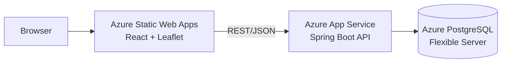

# customer-map

Full-stack web application that manages companies and visualizes their
locations on an interactive map. Modernized re-implementation of my bachelor
thesis project ("Development of a web application with map-based data
visualization", HHU Düsseldorf, 2023) — rebuilt from scratch with a current
stack and deployed to Microsoft Azure.

**Live demo:** _coming soon_

## Tech stack

| Layer      | Technology |
|------------|------------|
| Backend    | Java 21, Spring Boot 3.5, Spring Data JPA, Flyway, springdoc-openapi |
| Database   | PostgreSQL 16 (local: Docker · cloud: Azure Database for PostgreSQL) |
| Frontend   | React 18, TypeScript, Vite, react-leaflet / OpenStreetMap |
| CI/CD      | GitHub Actions → Azure App Service + Azure Static Web Apps |
| Testing    | JUnit 5, Mockito, ArchUnit (architecture rules), Vitest + Testing Library |

## Architecture



## Run locally

Prerequisites: Java 21 (downloaded automatically via Gradle toolchain),
Node.js 20+, Docker.

**1. Backend** (starts on http://localhost:8080)

```bash
cd backend
docker compose up -d     # PostgreSQL 16 in Docker
./gradlew bootRun        # Flyway migrates the schema on first start
```

Verify: http://localhost:8080/api/companies returns three demo companies.
Interactive API docs: http://localhost:8080/swagger-ui.html

**2. Frontend** (starts on http://localhost:5173)

```bash
cd frontend
npm install
cp .env.example .env     # sets VITE_API_URL=http://localhost:8080
npm run dev
```

Open http://localhost:5173 — the map shows all companies as markers;
new companies can be added via the form.

## Run tests

```bash
cd backend && ./gradlew test        # unit tests + ArchUnit architecture rules
cd frontend && npm test -- --run    # Vitest component tests
```

Both suites also run automatically in CI on every push (GitHub Actions).

## Configuration

All configuration is environment-based — no credentials in the repository.

| Variable | Used by | Default (local) |
|----------|---------|-----------------|
| `SPRING_DATASOURCE_URL` | backend | `jdbc:postgresql://localhost:5432/customermap` |
| `SPRING_DATASOURCE_USERNAME` | backend | `customermap` |
| `SPRING_DATASOURCE_PASSWORD` | backend | `localdev` |
| `APP_CORS_ALLOWED_ORIGINS` | backend | `http://localhost:5173` |
| `VITE_API_URL` | frontend | `http://localhost:8080` |

## Why a re-implementation?

The original thesis code was written during my working student position and
belongs to my former employer. This repository is a clean rebuild: same idea,
my own code, upgraded from Spring Boot 2.7/Java 11 to Spring Boot 3.5/Java 21,
Create React App replaced by Vite, and extended with CI/CD and cloud
deployment as part of my Azure certification path (AZ-900).

## Roadmap

- [ ] Deploy to Azure (App Service, Static Web Apps, PostgreSQL Flexible Server)
- [ ] Upgrade to Spring Boot 4.x as a dedicated migration step
- [ ] Infrastructure as Code (Bicep)
- [ ] Integration tests with Testcontainers
